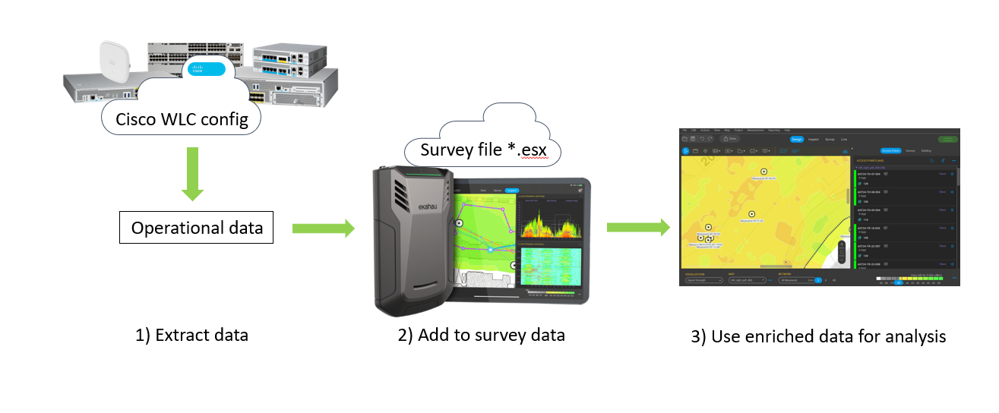
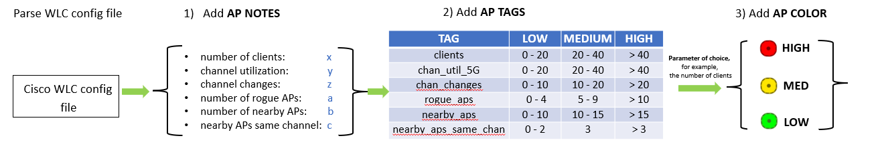
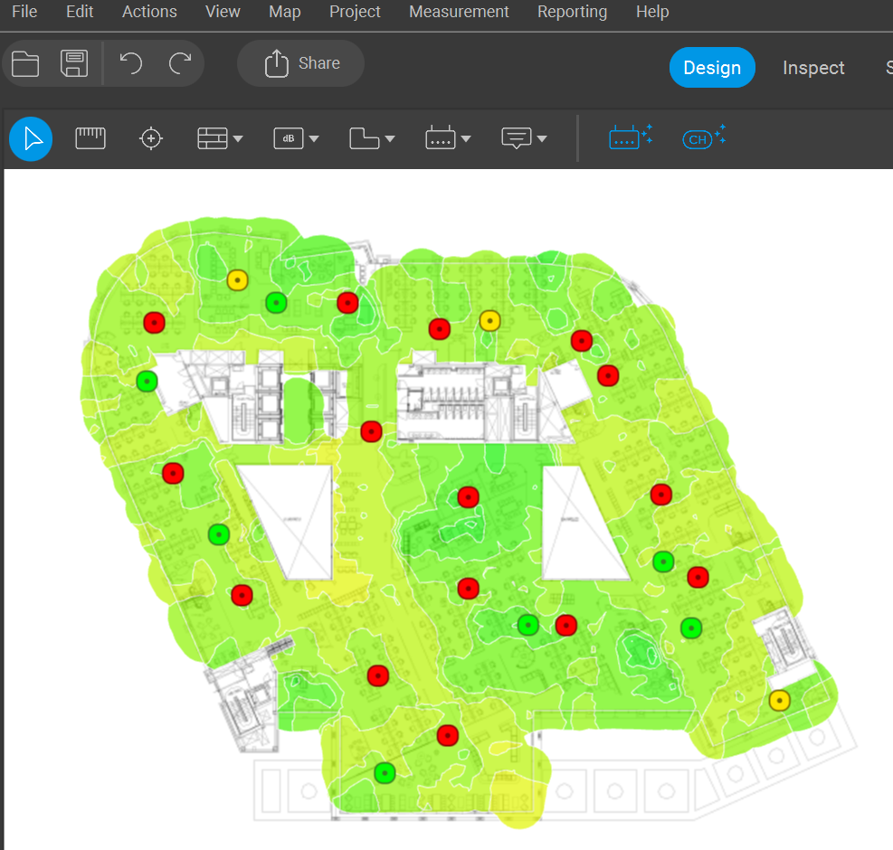
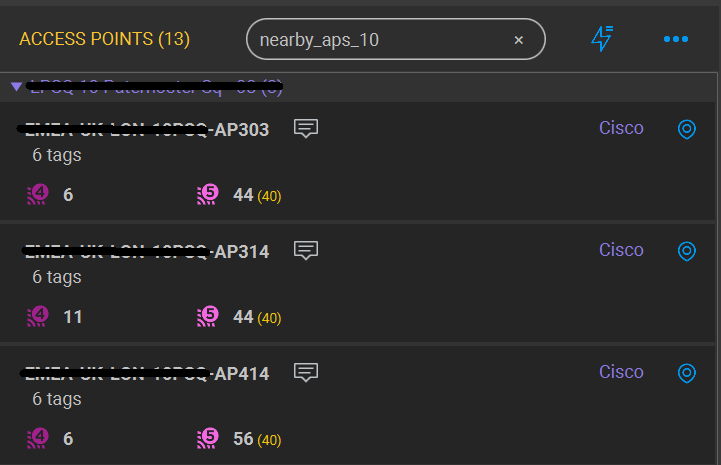
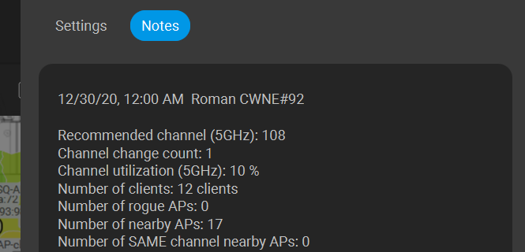

# Survey Insighter

This tool integrates operational data from the Cisco wireless controller with wireless survey data collected by Ekahau site survey tools.

The tool is particularly useful for complex use cases where it can assist wireless engineers in detailed analysis and issue prediction for high-density and mission-critical Wi-Fi deployments. 
Wireless surveys typically offer data from the viewpoint of wireless clients; however, they often miss out on the perspective of access points.

This tool bridges this gap by incorporating operational data from Cisco wireless controllers into Ekahau survey projects, offering a more comprehensive picture of your wireless network's status and performance.

The picture below illustrates how this tool works:



### Main use cases of this tool are following:

* enrich survey data with additional parameters that are reported by access points only and cannot be measured by survey device
* quickly highlight problematic access points on floor diagrams by using three colors for further analysis
* complement AP search to quickly find access points based on value of parameter (for example, find all access points that have many clients connected)
* view AP operational parameters right in the Ekahau survey software without opening Cisco WLC CLI just by opening AP notes

### Currently, the following parameters are extracted from Cisco WLC:

* number of clients
* channel utilization (for 5GHz band radio)
* number of channel changes (for 5GHz band radio)
* number of rogue access points
* number of nearby access points
* number of nearby access points using the same channel

When it comes to enriching a Ekahau survey project file with additional data, there are not so many options and these are listed below:

* Changing the color of access points: A method that was used to quickly highlight problematic APs based on value of one of the chosen parameter.
* Using AP tags: This allows for a more comprehensive search for APs within the survey project.
* Adding AP notes: This is the most informative way to add data, where extensive details can be provided for each access point.

This tool uses all of these methods as illustrated below:




## Screenshots with examples of enriched project file:

Here is the example of floor with access points highlighted based on the channel utilization. 
All the access points highlighted with red color have channel utilization higher than 40% due to proximity to open atrium and resulting high co-channel interference:



Here is the example of finding the group of access points that have a high number of rogue access points heard:



Here is the example of AP note that shows the full set of parsed parameters to make a deep dive without opening Cisco WLC CLI:



### How to use this tool:

* Download or clone script from github, no installation is required
* Add survey project file and Cisco WLC config file in the same folder
* Start script with three parameters defined:
  * First argument is the filename of WLC config file
  * Second argument is the filename of Ekahau survey file
  * Third argument is the parameter of choice to add color to access points. Only one parameter can be chosen at every run, use digits from 1 to 6:
    * 1 - the number of clients
    * 2 - channel utilization
    * 3 - channel changes
    * 4 - the number of rogue access points
    * 5 - the number of nearby access points
    * 6 - the number of nearby access points using the same channel


Here is the example of output of the tool:

```
(venv) PS C:\Users\rpodoyni\PycharmProjects\survey_insights> python .\cisco-survey-insights.py .\WLC_Config.txt .\Floors.esx 5
Number of NON-EMPTY lines in config file  76908
Parsing WLC config
Following WLCs were parsed from file:  ['EMEA-WC01']
New accessPoints.json file is written
New notes.json file is written
New tagKeys.json file is written
New project file is ready to use, filename is C:\Users\rpodoyni\PycharmProjects\survey_insights\Floors.esx_modified.esx
```

Then simply open the project file with name "<YOUR-FILENAME>_modified.esx" in Ekahau to view the survey with augmented data and highlighted problematic access points.


## How to get in touch for support\questions\ideas etc.

Collaboration via github tools is the preferred way, so open the issue, make pull request, fork, star etc.
Please add the following data to your issues:
* log file written during the issue (sensei.log from project folder)
* describe your environment (PC, OS version, Python version, libraries version)

## Compatible with data from these Cisco wireless controllers:

* Cisco AireOS WLC (collect the output of **show running-config** command)
* Cisco 9800 WLC (collect the output of **show tech-support wireless** command)


## Tested with:

* Ekahau PRO 10
* Ekahau AI PRO 11

## Dependencies:

The following list of standard Python libraries are used in this tool:
* shutil
* zipfile
* json
* os
* logging
* sys

All of these are standard libraries and do not require any installation efforts.